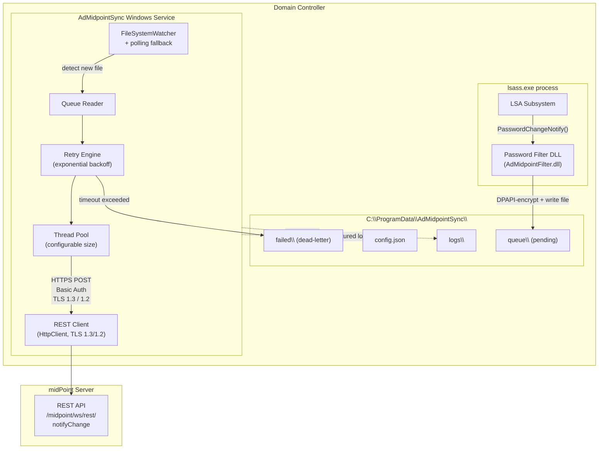
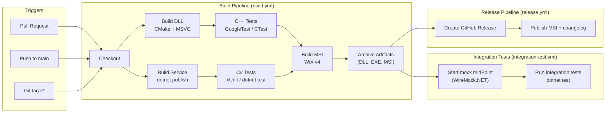

# High-Level Architecture Design — AD to midPoint Password Sync

**Version:** 0.1 (draft)
**Date:** 2026-03-08
**Status:** Internal — for review before customer delivery

---

## 1. Overview

This document describes the high-level architecture of the **AD to midPoint Password Synchronization** solution. The solution captures password change events on Active Directory Domain Controllers and propagates them to the midPoint Identity Governance system via its REST API.

### Goals

- Intercept every successful password change on all DCs in scope without impacting domain controller stability or performance.
- Deliver the new credential to midPoint reliably, with retry and offline-tolerance built in.
- Keep the security attack surface minimal: no password ever appears in logs, on disk unencrypted, or over a non-TLS channel.
- Be maintainable by a small team: two well-defined components, clean IPC boundary, observable via structured logs.

### Non-Goals (v1)

- OIDC / OAuth authentication to midPoint (deferred).
- Multi-language / i18n support (English only).
- Code signing of binaries.
- Security penetration testing.
- FIPS-140 compliance.

---

## 2. Core Architecture

The solution consists of exactly two deployable components that run on every Domain Controller in scope:

| Component | Runtime | Role |
|---|---|---|
| **Password Filter DLL** | C/C++, loaded into `lsass.exe` | Captures password change event, writes encrypted event file, returns immediately |
| **Password Sync Service** | C# (.NET), Windows Service | Reads event queue, encrypts/decrypts, calls midPoint REST API, handles retry |

The two components communicate via a **file-based queue** stored in `C:\ProgramData\AdMidpointSync\queue\` (see Section 6 for IPC alternatives and justification of this choice).



---

## 3. Component Details

### 3.1 Password Filter DLL (C/C++)

**Purpose.** The Windows LSA Password Filter interface (`winnt.h`) allows a registered DLL to be notified of every successful password change before it is committed. The DLL runs inside `lsass.exe` — the most security-sensitive process on a Windows machine — so its code must be minimal, deterministic, and incapable of crashing or blocking the authentication subsystem.

**LSA interface implemented:**

| Export | Behaviour |
|---|---|
| `InitializeChangeNotify()` | Called once on DC boot; initialises internal state, returns `TRUE` |
| `PasswordFilter()` | Called to validate a candidate new password; this solution always returns `TRUE` (approve) — filtering is not in scope |
| `PasswordChangeNotify()` | Called after a successful password change; this is where the solution acts |

**What `PasswordChangeNotify` does:**

1. Receives `UserName`, `RelativeId` (RID), and `NewPassword` (in a `UNICODE_STRING`).
2. Constructs a JSON event payload in memory: `{ "eventId": "<UUID>", "timestamp": "<ISO-8601>", "domain": "<NETBIOS>", "username": "<sam>", "password": "<cleartext>" }`.
3. Encrypts the payload with **machine-scope DPAPI** (`CryptProtectData`, `CRYPTPROTECT_LOCAL_MACHINE`).
4. Writes the encrypted blob to `queue\<timestamp>-<uuid>.evt` atomically (write to a temp name, then `MoveFileEx` to final name to avoid partial reads by the service).
5. Clears the in-memory plaintext password buffer (`SecureZeroMemory`).
6. Returns `NTSTATUS STATUS_SUCCESS`.

**Key constraints:**

- No network I/O, no COM, no CLR, no dynamic library loading inside the DLL.
- No heap allocations that can fail silently and leave the password in memory; use RAII wrappers.
- If the queue write fails (disk full, permissions), log the failure to the Windows Application Event Log (a single `ReportEvent` call is acceptable) and return success — the LSA must not be blocked.
- Compiled as a native 64-bit DLL with `/GS`, `/DYNAMICBASE`, `/NXCOMPAT`, minimal CRT dependency.

---

### 3.2 Password Sync Service (C#)

**Purpose.** A long-running Windows Service that consumes the event queue written by the DLL and delivers each event to midPoint via HTTPS REST. It owns all the "smart" logic: encryption/decryption, retry, concurrency, TLS policy, and logging.

**Windows Service lifecycle:**

- `OnStart`: load config, initialise Serilog, start `FileSystemWatcher` on `queue\`, start background thread pool, start polling timer.
- `OnStop`: signal cancellation, drain in-flight events up to a short grace period (e.g., 10 seconds), flush logs.
- `OnShutdown`: same as `OnStop` (handles OS shutdown signal).

**Queue consumer:**

- `FileSystemWatcher` raises events on new `*.evt` files.
- A polling timer (e.g., every 30 seconds) scans `queue\` to catch any events missed under high load.
- Each detected file is handed to the thread pool.

**Encryption (DPAPI):**

- The service decrypts event files using `System.Security.Cryptography.ProtectedData` with `DataProtectionScope.LocalMachine`.
- midPoint credentials (username + password) stored in `config.json` are also DPAPI-encrypted at rest; a separate config-write tool (or installer action) encrypts them during setup.

**REST client — midPoint `notifyChange` API:**

- `HttpClient` configured with `SocketsHttpHandler` for connection pooling.
- TLS policy: default to TLS 1.3; fall back to TLS 1.2 on WS 2016/2019 (detected at startup via `Environment.OSVersion`).
- `tlsSkipVerification` config flag: sets `ServerCertificateCustomValidationCallback` to always return true — only for dev environments, logged as a warning on startup.
- Authentication: `Authorization: Basic <base64(user:pass)>` header.
- Timeout: derived from `retryIntervalSeconds` config.

**Retry logic:**

- On HTTP 2xx: delete the event file, log success.
- On transient failure (network error, HTTP 5xx, timeout): schedule retry with exponential backoff (`retryIntervalSeconds * 2^attempt`, capped at a maximum interval).
- If `now - event.timestamp > retryTimeoutSeconds`: move file to `failed\`, log drop event (including `eventId` and `username` but NOT the password), increment a counter metric.
- On HTTP 4xx (client error, e.g., 401 Unauthorized): treat as permanent failure, move to `failed\`, log with details.

**Thread pool:**

- `SemaphoreSlim`-gated `Task` dispatch with configurable maximum degree of parallelism (`threadPoolSize`).
- Each task owns one event file exclusively (file open with `FileShare.None`).

**Configuration management:**

- Read `config.json` on startup; support `FileSystemWatcher`-based live reload for non-sensitive fields (log level, thread pool size). Credential changes require a service restart.
- Validate all required fields on startup; log and refuse to start if invalid.

**Structured logging — Serilog:**

- Configured via code (not `appsettings.json`) so the service has no ASP.NET dependency.
- Default sinks: rolling file under `logs\` (daily, configurable retention).
- Output format: structured JSON by default; human-readable template available via config.
- Additional sinks (e.g., Windows Event Log, SEQ) can be added via Serilog config without code changes.

---

### 3.3 Queue (IPC & Persistence Layer)

The queue directory serves as both the IPC channel between the DLL and the service, and the persistence layer for event durability. It is a plain directory on the local filesystem.

#### Directory Structure

```
C:\ProgramData\AdMidpointSync\
  queue\          <- pending encrypted event files (written by DLL, consumed by service)
  failed\         <- events that exceeded retry timeout or received permanent errors
                     (kept on disk for admin inspection; logged at drop time)
  logs\           <- Serilog rolling log files
  config.json     <- service configuration (credentials stored DPAPI-encrypted within)
```

NTFS permissions on the root directory are set by the MSI installer:

| Principal | Rights |
|---|---|
| `SYSTEM` | Full Control (DLL runs as SYSTEM inside lsass) |
| Service account | Modify on `queue\`, `failed\`, `logs\`; Read on `config.json` |
| `Administrators` | Full Control |
| Everyone | No access |

#### Event File Format

- **Filename:** `<ISO-8601-timestamp>-<UUID>.evt` — e.g., `20260308T142301Z-550e8400-e29b-41d4-a716-446655440000.evt`
- Timestamp-prefixed names give natural ordering for the service consumer and aid manual inspection.
- **Content:** DPAPI-encrypted binary blob. When decrypted, the plaintext is a UTF-8 JSON object:

```json
{
  "eventId": "550e8400-e29b-41d4-a716-446655440000",
  "timestamp": "2026-03-08T14:23:01.123Z",
  "domain": "CORP",
  "username": "jdoe",
  "password": "<cleartext password — only exists in memory after decryption>"
}
```

- The file is written atomically: DLL writes to `queue\<name>.tmp`, then renames to `queue\<name>.evt`. The service only processes `.evt` files.
- After successful delivery or final failure, the service deletes (or moves) the file.

---

### 3.4 MSI Installer (WiX Toolset)

The installer is built with **WiX Toolset v4** and produces a single `.msi` package for all supported OS versions.

**Installation actions:**

1. Detect OS version; set registry-handling properties accordingly.
2. Create `C:\ProgramData\AdMidpointSync\` directory tree with correct NTFS ACLs.
3. Install the DLL to `C:\Windows\System32\AdMidpointFilter.dll`.
4. Register the DLL in `HKLM\SYSTEM\CurrentControlSet\Control\Lsa\Notification Packages` (append, do not overwrite other filters — multi-filter coexistence is supported).
5. Install the service executable to `C:\Program Files\AdMidpointSync\AdMidpointSync.exe`.
6. Register and configure the Windows Service (`sc create`, or equivalent WiX `ServiceInstall` element) with `start=auto`, `type=own`.
7. Write a default `config.json` if one does not already exist (preserves existing config on upgrade).
8. Optionally prompt for midPoint URL and credentials and write DPAPI-encrypted values into `config.json` (can also be deferred to a post-install configuration step).
9. Start the service.

**Silent install (GPO / SCCM):**

```
msiexec /i AdMidpointSync-1.0.0.msi /qn ^
  MIDPOINT_URL="https://midpoint.example.com" ^
  MIDPOINT_USER="syncuser" ^
  MIDPOINT_PASS="secret" ^
  QUEUE_DIR="C:\ProgramData\AdMidpointSync\queue" ^
  LOG_LEVEL="Information"
```

**Upgrade:**

- WiX `MajorUpgrade` element handles in-place upgrades.
- Installer stops the service, replaces binaries, restarts the service.
- `queue\`, `failed\`, `logs\`, and `config.json` are explicitly excluded from removal — they survive upgrade.

**Uninstall:**

- Removes binaries and service registration.
- Removes the DLL entry from the `Notification Packages` registry value.
- Does **not** remove `C:\ProgramData\AdMidpointSync\` — data directory is preserved for admin inspection.
- A separate "purge" flag or manual step is documented for complete removal.

**OS version detection:**

- WiX condition checks on `VersionNT` property handle any registry or behaviour differences across WS 2016–2025.

---

### 3.5 Configuration

Configuration is stored in `C:\ProgramData\AdMidpointSync\config.json`. Sensitive values (credentials) are stored as DPAPI-encrypted Base64 strings within the JSON, not as plaintext.

| Parameter | Type | Default | Description |
|---|---|---|---|
| `midPointUrl` | string | — (required) | Base URL of the midPoint REST API |
| `midPointUsername` | string (DPAPI-encrypted) | — (required) | HTTP Basic Auth username |
| `midPointPassword` | string (DPAPI-encrypted) | — (required) | HTTP Basic Auth password |
| `queueDirectory` | string | `C:\ProgramData\AdMidpointSync\queue` | Path to the pending event queue |
| `maxQueueDepth` | int | `10000` | Max number of pending `.evt` files; new events are dropped and logged when exceeded |
| `retryTimeoutSeconds` | int | `86400` (24h) | Max age of an event before it is dropped to `failed\` |
| `retryIntervalSeconds` | int | `30` | Base interval for first retry; subsequent retries use exponential backoff |
| `threadPoolSize` | int | `4` | Max number of concurrent event delivery tasks |
| `tlsSkipVerification` | bool | `false` | Dev escape hatch: skip TLS certificate validation; logs a warning on startup |
| `logDirectory` | string | `C:\ProgramData\AdMidpointSync\logs` | Directory for Serilog rolling log files |
| `logLevel` | string | `Information` | Minimum log level: `Verbose`, `Debug`, `Information`, `Warning`, `Error`, `Fatal` |
| `logRetentionDays` | int | `30` | Number of days to retain rolling log files |

---

### 3.6 Logging

**Framework:** Serilog, configured in code (no ASP.NET dependency).

**Default sink:** Rolling file under `logDirectory`, one file per day, retention controlled by `logRetentionDays`. Format: structured JSON by default; a human-readable template can be enabled via config for debugging.

**Additional sinks:** Windows Event Log, SEQ, or any other Serilog sink can be wired in without code changes by adding a sink package and updating configuration.

**Logged event types:**

| Event | Level | Fields logged (password never included) |
|---|---|---|
| Service started | Information | version, config summary, TLS policy, thread pool size |
| `tlsSkipVerification=true` detected | Warning | — |
| Event file detected | Debug | eventId, filename, timestamp |
| Event enqueued (DLL side, via Event Log) | — | username, domain (no password) |
| Queue depth exceeded — event dropped | Warning | username, domain, queueDepth |
| Delivery attempt | Debug | eventId, attempt number, target URL |
| Delivery success | Information | eventId, username, domain, duration |
| Delivery failure (transient) | Warning | eventId, attempt, statusCode or exception message, nextRetryAt |
| Delivery failure (permanent / 4xx) | Error | eventId, username, domain, statusCode |
| Event dropped (retry timeout) | Error | eventId, username, domain, eventAge |
| Service stopping | Information | inFlight count, gracePeriod |

**Rule:** Password values are never passed to any logging call site. The plaintext password string is cleared from memory (`SecureZeroMemory` / overwrite) immediately after the REST call completes or fails.

---

## 4. Security Considerations

| Concern | Mitigation |
|---|---|
| Password exposure at rest | DPAPI `LocalMachine` scope encryption on every event file; credentials in config are also DPAPI-encrypted |
| Password exposure in transit | HTTPS only; TLS 1.3 on WS 2022/2025, TLS 1.2 on WS 2016/2019; plaintext HTTP not supported |
| Password exposure in logs | Logging call sites never receive the password value; enforced by code review |
| DLL instability crashing lsass | Strict no-blocking rule; all DLL code paths are bounded; error handling returns gracefully |
| DPAPI from lsass.exe context | Use `CRYPTPROTECT_LOCAL_MACHINE` flag; verify explicitly in test environment that decryption succeeds from service context |
| Privilege escalation via service | Service runs as a dedicated low-privilege local service account (not `SYSTEM`, not `NetworkService`); account has only Write to `ProgramData\AdMidpointSync` and outbound HTTPS |
| Credential storage | `midPointPassword` is never written as plaintext; installer encrypts with DPAPI before writing config; config file ACL restricts read to service account and admins |
| TLS certificate validation | OS trust store is used; `tlsSkipVerification` flag is explicitly dev-only, logs a startup warning, and must not be set in production |
| Third-party DLL coexistence | Multiple `Notification Packages` entries are supported by LSA; the installer appends rather than replaces |
| Windows Defender compatibility | DLL injection into lsass is expected by Defender for registered LSA filters; test early against Defender to detect any false positives; document any required exclusion |

---

## 5. Multi-Domain / Multi-Forest Consideration

**Single domain/forest (standard case):** One installation per DC set, one `config.json`, one midPoint endpoint. All DCs in the domain run identical installations. No special handling required.

**Multi-domain / multi-forest:** Each domain's DCs run their own independent installation with their own `config.json`. The config supports pointing to:

- The same midPoint endpoint with different credentials per domain, or
- A different midPoint endpoint per domain.

The DLL captures the NETBIOS domain name in the event payload (`domain` field), so midPoint can distinguish the originating domain even when events arrive at a single endpoint.

**Estimate alternatives** (to be presented to the customer):

| Option | Effort delta vs. baseline | Notes |
|---|---|---|
| Single domain | Baseline | Standard deployment |
| Multiple domains, same forest, one midPoint endpoint | +0 (config only) | Each DC set configured independently; no code change |
| Multiple forests, one midPoint endpoint per forest | +0 (config only) | Same as above, different endpoint URLs |
| Centralised proxy / aggregator service | +L (large) | Separate aggregation component; out of scope for v1 |

---

## 6. IPC Alternatives

Three mechanisms were evaluated for passing events from the DLL (running inside `lsass.exe`) to the Windows Service.

### Alternative A: File-Based Queue (Recommended)

The DLL writes a DPAPI-encrypted event file to the queue directory. The service uses `FileSystemWatcher` with a polling fallback (scan every 30 seconds) to detect and process new files.

**Pros:**
- Simple implementation in both DLL and service.
- Naturally durable: events survive service restarts and OS crashes (pending reboot) — they sit on disk.
- Events are visible to administrators for manual inspection and republication.
- Dead-letter is trivially implemented via a `failed\` subdirectory.
- No additional Windows features or components required.
- Easy to debug: event files can be inspected (after decryption) with a separate tool.
- Atomic write via rename prevents partial reads.

**Cons:**
- File I/O overhead per event (acceptable for password change frequency on most DCs).
- `FileSystemWatcher` can miss events under extreme burst load — mitigated by the polling fallback.
- File locking must be handled carefully to avoid read/write races (mitigated by atomic rename and `FileShare.None` open in service).
- DPAPI encryption from inside `lsass.exe` requires `CRYPTPROTECT_LOCAL_MACHINE` scope; this must be explicitly tested in the lsass context.

---

### Alternative B: Named Pipe with File-Based Fallback

The service hosts a named pipe server. The DLL attempts to connect and write the event to the pipe (fast path). If the service is unavailable, the DLL falls back to writing an encrypted file (same as Alternative A).

**Pros:**
- Lower latency in the happy path — no file system round-trip.
- Near-synchronous feel: the DLL knows immediately if delivery to the service succeeded.

**Cons:**
- Significantly more complex: two distinct code paths in both DLL and service must be maintained and tested.
- Named pipe buffer limits can cause backpressure under burst load; the DLL cannot block waiting for the pipe.
- The fallback path still requires the full file-based complexity of Alternative A, so neither path is eliminated.
- Named pipe ACL setup from the lsass context requires careful handling (pipe server must grant lsass WRITE access).
- Harder to debug: in-flight events are not visible on disk until they hit the fallback.
- More surface area for bugs in the most security-sensitive process on the machine.

---

### Alternative C: Windows MSMQ (Message Queuing Service)

The DLL writes messages to a local MSMQ private queue. The service reads from MSMQ. MSMQ provides built-in transactional delivery and persistence.

**Pros:**
- Built-in transactional delivery semantics.
- Built-in persistence: messages survive service restarts without custom code.
- No custom queue management code.
- Well-understood enterprise messaging technology.

**Cons:**
- MSMQ is a Windows optional feature that must be explicitly enabled — it is not present by default and requires MSI custom actions to enable it, complicating installation.
- MSMQ has been deprecated and its future in Windows Server is uncertain; it is absent from some minimal server installations.
- Adding a Windows feature dependency increases the attack surface and operational complexity.
- MSMQ API usage from inside `lsass.exe` is non-trivial and poorly documented.
- Custom setup in the MSI is significantly more complex than creating a directory.

---

### Recommendation

**Alternative A (File-Based Queue)** is recommended. It is the simplest correct solution, provides natural durability without additional infrastructure, and requires no Windows features beyond what is always present. The lsass.exe DPAPI constraint (machine-scope) is a well-understood pattern. The polling fallback eliminates the main reliability concern with `FileSystemWatcher`.

---

## 7. CI/CD Pipeline

### 7.1 Pipeline Overview



### 7.2 Build Pipeline

**Trigger:** Push to `main`, pull requests to `main`.

**Runner:** `windows-2022` (GitHub-hosted) — provides MSVC, .NET SDK, and WiX Toolset.

**Steps:**

1. **Checkout** — `actions/checkout@v4` with full history for versioning.
2. **Build DLL** — CMake configure + build in `Release` mode using MSVC (`cl.exe`); build matrix covers `Release` and `Debug` configurations.
3. **Build Service** — `dotnet publish` as self-contained single-file executable targeting `win-x64`.
4. **Run C++ unit tests** — `ctest --output-on-failure` via Google Test.
5. **Run C# unit tests** — `dotnet test` with xUnit; output in TRX format for GitHub Actions test reporter.
6. **Build MSI** — WiX v4 CLI (`wix build`) producing `AdMidpointSync-<version>.msi`.
7. **Archive artifacts** — `actions/upload-artifact` for DLL, service EXE, and MSI.

### 7.3 Release Pipeline

**Trigger:** Git tag matching `v*` (e.g., `v1.0.0`).

**Steps:**

1. Run full build pipeline (reuse or re-run).
2. Extract changelog section for the tagged version.
3. Create GitHub Release with the MSI as a binary asset and the changelog as the release body.
4. Publish versioned artifacts to the release.

### 7.4 Integration / E2E Test Pipeline

**Trigger:** Push to `main`, pull requests (optional — can be scheduled nightly for speed).

**Runner:** `windows-2022`.

**Steps:**

1. Start mock midPoint REST endpoint using WireMock.NET (or a minimal ASP.NET stub in `tools/mock-midpoint/`).
2. Install the service against the mock endpoint.
3. Run integration test suite (`dotnet test` targeting `tests/sync-service-tests/` integration test category):
   - Happy path: inject an event file → verify mock received the expected `notifyChange` call.
   - midPoint unavailable: stop mock → inject event → verify retry behaviour.
   - Retry exhaustion: set short `retryTimeoutSeconds` → verify event moved to `failed\`.
4. Collect logs as artifacts on failure.

---

## 8. Testing Strategy

### 8.1 Unit Tests

**C++ DLL (Google Test):**
- Queue write logic: verify file is created with correct name format.
- Atomic rename: verify `.tmp` → `.evt` rename; verify partial files are not picked up.
- DPAPI encryption round-trip: encrypt with machine scope, decrypt, verify payload.
- Error paths: disk-full simulation, permissions error — verify function returns success without crash.

**C# Service (xUnit):**
- Retry engine: verify exponential backoff intervals, verify drop-on-timeout, verify permanent-failure handling.
- REST client: mock `HttpMessageHandler`; verify correct headers, TLS policy, Basic Auth encoding.
- Config loading: valid config, missing required field, DPAPI-encrypted credential round-trip.
- DPAPI wrapper: encrypt + decrypt round-trip.
- Queue reader: verify `FileSystemWatcher` events trigger processing; verify polling fallback scans directory.
- Thread pool gate: verify `maxDegreeOfParallelism` is respected.

### 8.2 Integration Tests

- Mock midPoint REST endpoint (WireMock.NET).
- Service deployed and configured against mock.
- Scenarios: happy path, mock returns 500 (transient), mock returns 401 (permanent), mock unavailable for N seconds then recovers.
- Automated, runs in CI on every push to `main`.

### 8.3 End-to-End Tests (Automated Where Possible)

- Requires a real AD DC environment (or an AD-compatible VM).
- PowerShell script: force a password change for a test account → wait → verify mock midPoint received the `notifyChange` call with the correct username.
- Scripted to run against a pre-built VM image; goal is automation, fallback is a documented manual checklist.

### 8.4 Manual Test Scenarios

| Scenario | Method |
|---|---|
| Burst test: 1000 simultaneous password expirations | PowerShell script: bulk-set `pwdLastSet=0` on 1000 test accounts, trigger password change for each |
| OS compatibility: WS 2016, 2019, 2022, 2025 | Deploy MSI on each VM image; run happy-path E2E |
| Windows Defender compatibility | Enable real-time protection; install and run; verify no quarantine or alert |
| Upgrade: install v1, change password, upgrade to v2 | Verify queue events survive MSI upgrade; verify service restarts cleanly |
| Uninstall | Verify `ProgramData\AdMidpointSync\` is preserved after `msiexec /x` |

### 8.5 OS Compatibility Test Environments

- 4 pre-configured VM images with AD DS role installed and promoted:
  - Windows Server 2016 (with TLS 1.2 fallback requirement)
  - Windows Server 2019
  - Windows Server 2022
  - Windows Server 2025
- If automation budget allows: Vagrant + Packer or Azure ARM templates for reproducible baseline builds.
- Worst case: 4 manually maintained VM snapshots at a known clean state.

---

## 9. Documentation Deliverables

### 9.1 Administrator Guide

Delivered as `docs/admin-guide.md` (and optionally a PDF export).

- **Installation:** MSI parameters reference; silent install examples for GPO and SCCM deployment.
- **Configuration:** Every `config.json` parameter documented with type, default, valid range, and example.
- **Credential rotation:** How to update the midPoint password after initial setup (re-run installer, or a `config-tool.exe` helper that re-encrypts and writes the new value).
- **Log interpretation:** What each log event type means; how to correlate `eventId` across DLL Event Log entries and service log files.
- **Troubleshooting:** Common failure modes:
  - DLL not loaded (check `Notification Packages` registry, check Application Event Log).
  - Service not starting (check config validity, check service account permissions).
  - midPoint unreachable (check network, TLS certificate, credentials).
  - Queue growing without being consumed (service stopped or misconfigured).
  - `failed\` directory accumulating files (retry timeout too short, or midPoint permanently rejecting events).
- **Checking status:** How to verify the DLL is loaded (`reg query`, `Process Explorer`); how to check service status (`sc query`, `services.msc`).

### 9.2 Build & Developer Guide

Delivered as `docs/build-guide.md`.

- **Prerequisites:** Visual Studio 2022 (or Build Tools) with C++ workload, .NET SDK 8.0+, WiX Toolset v4, CMake 3.21+, Git.
- **Local build:** Step-by-step `cmake`, `dotnet build`, `wix build` commands.
- **Local dev environment:** Option A — real AD DC VM + real or mock midPoint; Option B — mock midPoint only (service can be tested without a real DC).
- **Running tests locally:** `ctest`, `dotnet test` commands; how to run with the mock midPoint.
- **Contributing:** Branch naming, PR process, code style notes, EUPL 1.2 header requirement for new files.

### 9.3 EUPL 1.2 Compliance

- `LICENSE` file in repository root containing the full EUPL 1.2 text.
- `NOTICE` file listing third-party dependencies and their licences (Serilog: Apache 2.0; Google Test: BSD-3; WiX: MS-RL or Microsoft Reciprocal License — verify compatibility).
- EUPL 1.2 header comment in every source file (`.cpp`, `.h`, `.cs`).
- `README.md` includes a licence badge and a short EUPL 1.2 notice.

---

## 10. Repository Structure

```
/
├── LICENSE                          # EUPL 1.2 full text
├── NOTICE                           # Third-party dependency licences
├── README.md                        # Project overview, licence badge, quick start
├── docs/
│   ├── admin-guide.md               # Administrator installation and operations guide
│   └── build-guide.md               # Developer build and contribution guide
├── src/
│   ├── filter-dll/                  # C/C++ LSA Password Filter DLL
│   │   ├── CMakeLists.txt
│   │   ├── include/
│   │   │   └── password_filter.h
│   │   └── src/
│   │       ├── dllmain.cpp          # DllMain, InitializeChangeNotify, PasswordFilter
│   │       ├── password_notify.cpp  # PasswordChangeNotify implementation
│   │       ├── queue_writer.cpp     # Atomic file write + DPAPI encryption
│   │       └── event_log.cpp        # ReportEvent wrapper for error logging
│   ├── sync-service/                # C# Windows Service
│   │   ├── AdMidpointSync.csproj
│   │   ├── Program.cs               # Service entry point
│   │   ├── Worker.cs                # BackgroundService / OnStart / OnStop
│   │   ├── QueueReader.cs           # FileSystemWatcher + polling
│   │   ├── RetryEngine.cs           # Exponential backoff, drop logic
│   │   ├── MidPointClient.cs        # HttpClient wrapper, TLS policy
│   │   ├── DpapiHelper.cs           # ProtectedData encrypt/decrypt
│   │   ├── Configuration.cs         # Config model + loader + validator
│   │   └── Logging/
│   │       └── LoggingConfiguration.cs  # Serilog setup
│   └── installer/                   # WiX v4 MSI project
│       ├── AdMidpointSync.wixproj
│       ├── Package.wxs              # Main package definition
│       ├── Product.wxs              # Feature/component tree
│       ├── ServiceInstall.wxs       # Service registration
│       ├── RegistryConfig.wxs       # Notification Packages registry
│       └── CustomActions/           # Managed custom actions (DPAPI config write)
│           └── ConfigAction.cs
├── tests/
│   ├── filter-dll-tests/            # Google Test suite for C++ DLL
│   │   ├── CMakeLists.txt
│   │   ├── queue_writer_tests.cpp
│   │   └── dpapi_tests.cpp
│   ├── sync-service-tests/          # xUnit suite for C# service
│   │   ├── AdMidpointSync.Tests.csproj
│   │   ├── RetryEngineTests.cs
│   │   ├── MidPointClientTests.cs
│   │   ├── QueueReaderTests.cs
│   │   ├── DpapiHelperTests.cs
│   │   └── ConfigurationTests.cs
│   └── e2e/                         # PowerShell E2E scripts
│       ├── Invoke-HappyPath.ps1
│       ├── Invoke-BurstTest.ps1
│       └── helpers/
│           └── MockMidPoint.ps1
├── tools/
│   └── mock-midpoint/               # Minimal ASP.NET stub or WireMock.NET runner
│       ├── MockMidPoint.csproj
│       └── Program.cs
└── .github/
    └── workflows/
        ├── build.yml                # Build + unit test pipeline
        ├── release.yml              # Release pipeline (triggered by v* tags)
        └── integration-test.yml     # Integration + E2E test pipeline
```

---

## 11. Key Risks and Mitigations

| Risk | Likelihood | Impact | Mitigation |
|---|---|---|---|
| DLL bug crashes or hangs `lsass.exe` | Low (with discipline) | Critical (DC outage) | Strict no-blocking rule enforced by code review and static analysis; all code paths bounded; extensive unit testing; staged rollout (test DC first) |
| DPAPI encryption fails from `lsass.exe` context | Medium | High (events lost silently) | Use `CRYPTPROTECT_LOCAL_MACHINE` flag explicitly; write a dedicated integration test that runs the DLL code path from a lsass-context test harness; test on all 4 OS versions |
| Burst load exhausts queue or thread pool | Medium | Medium (events dropped, logged) | Configurable `maxQueueDepth` and `threadPoolSize`; manual burst test (1000 passwords) validates behaviour before acceptance |
| TLS 1.2 fallback issues on WS 2016/2019 | Medium | Medium (all events fail) | Implement and test TLS 1.2 path explicitly on WS 2016 VM image in CI or pre-release test run |
| Windows Defender quarantines DLL or flags lsass injection | Low | High (DLL silently not loaded) | Test against Defender early in development; document any required exclusion in admin guide; registered LSA filters are expected by Defender |
| midPoint REST API contract changes | Low (API assumed stable) | High (all deliveries fail) | Encapsulate API call in `MidPointClient`; pin expected request/response schema in integration tests against mock; version-document the API contract used |
| Queue grows unbounded if service is stopped long-term | Medium | Low (disk space) | `maxQueueDepth` config with drop-and-log; admin guide documents monitoring the queue directory; OS disk monitoring is customer responsibility |
| File locking race between DLL writer and service reader | Low | Low (event skipped, retried) | Atomic rename strategy eliminates partial-read races; service opens files with exclusive lock; polling fallback catches missed files |
| WiX installer fails on one of the 4 OS versions | Low | Medium (deployment blocked) | Test MSI on all 4 OS version VM images before release; WiX condition checks for OS-specific differences |
